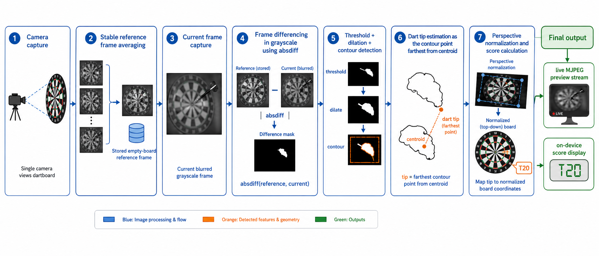
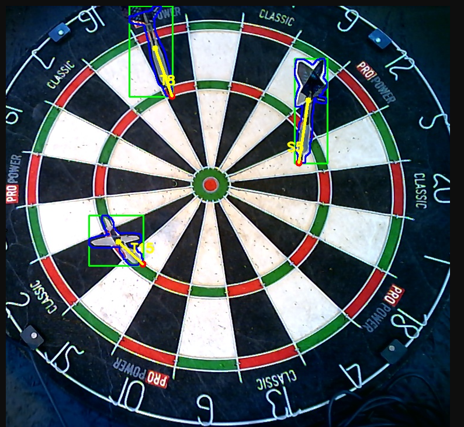
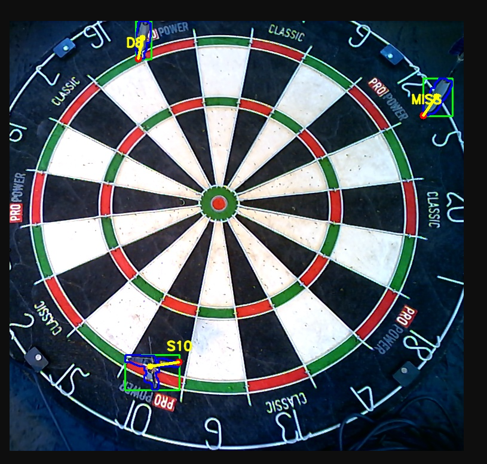
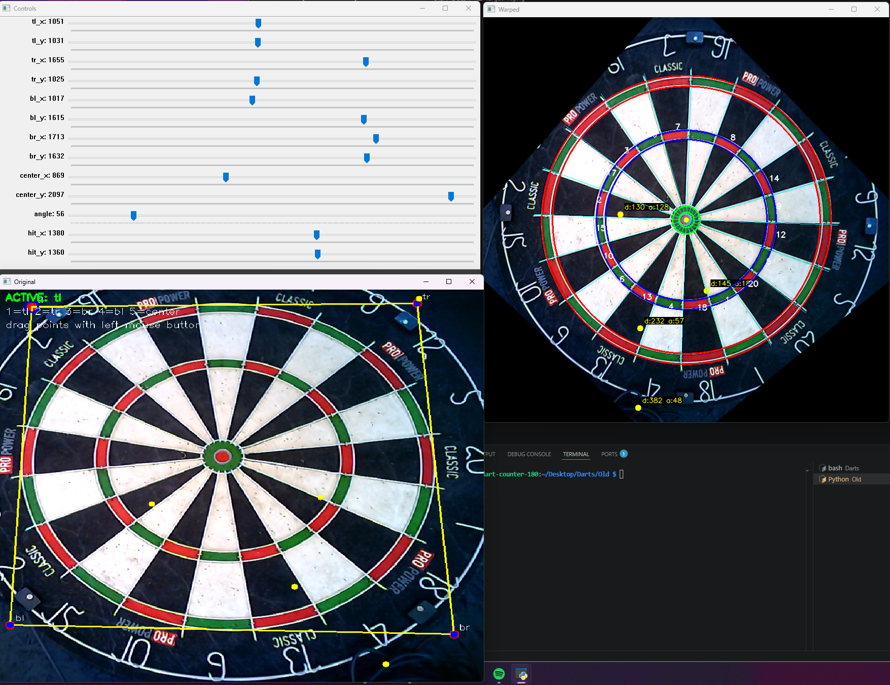
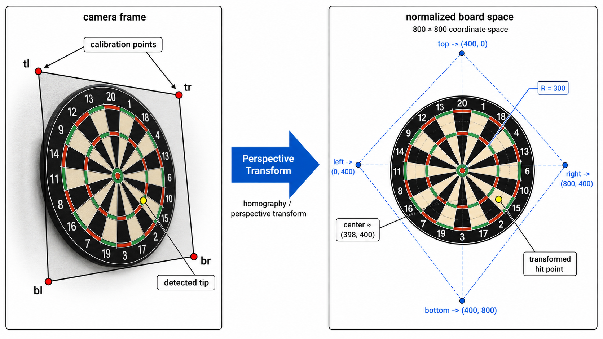
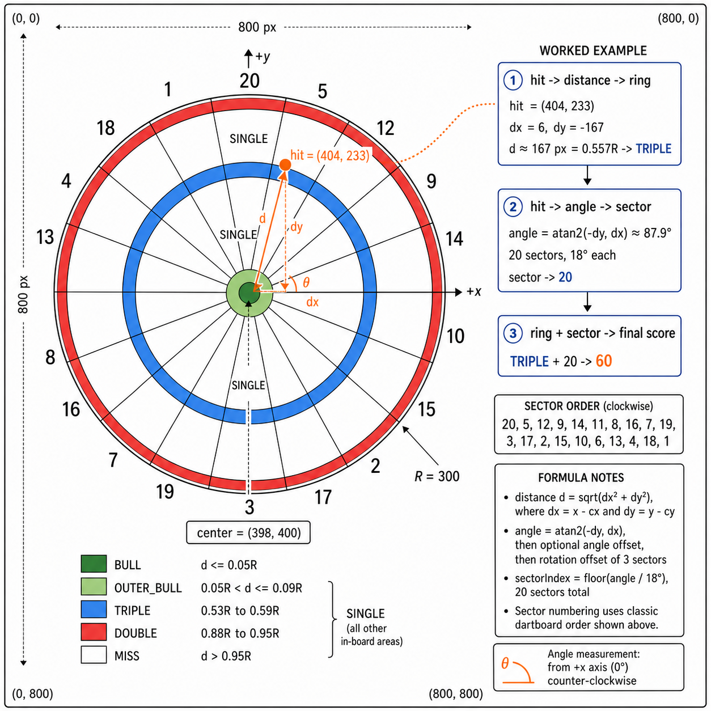
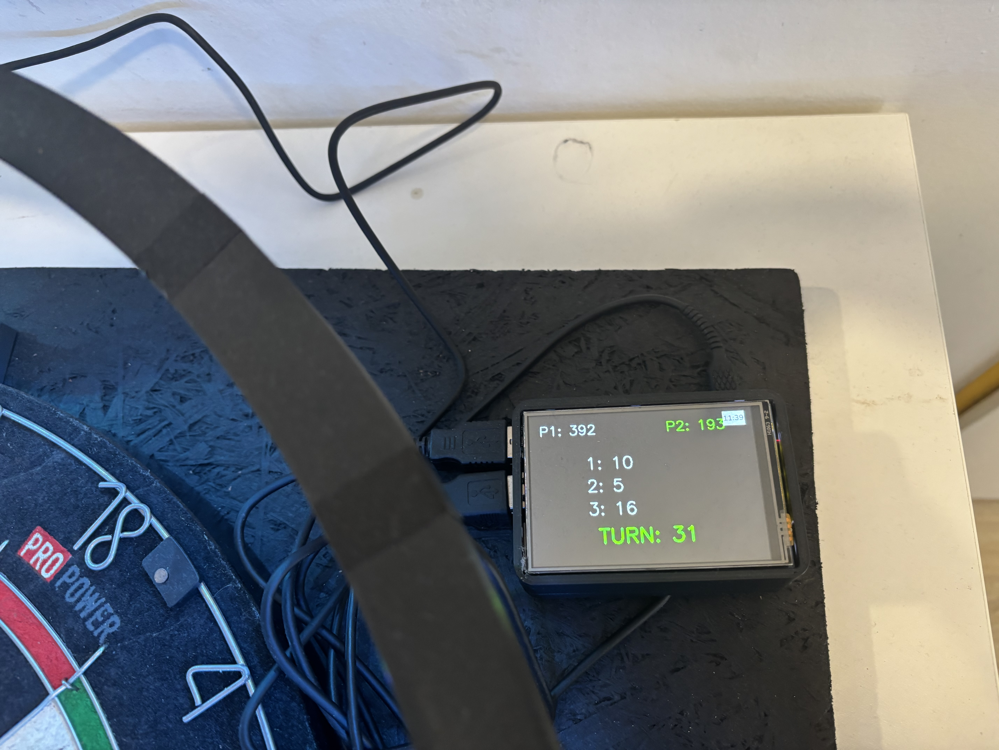
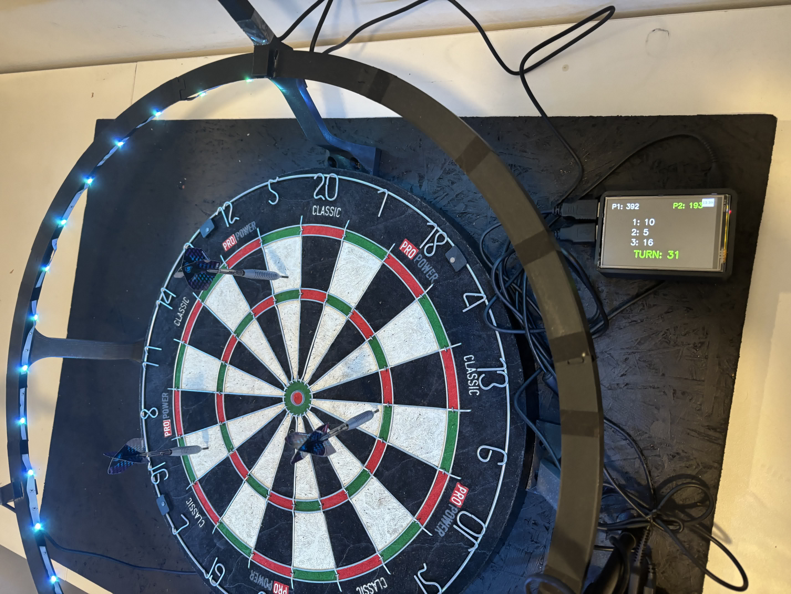

## Popis projektu

Cílem projektu je návrh a realizace systému pro automatické skórování při hře šipky. Systém využívá USB kameru pro snímání terče, následné zpracování obrazu a automatický výpočet bodového zisku podle místa zásahu šipky. Výsledky jsou zobrazovány na dotykovém LCD displeji, který zároveň slouží jako jednoduché uživatelské rozhraní.

Projekt demonstruje možnosti využití platformy Raspberry Pi v oblasti:

- zpracování obrazu
- detekce objektů
- výpočtu skóre podle pozice zásahu
- realizace interaktivního uživatelského rozhraní

Tato složka obsahuje starší jednokamerovou verzi systému. Přestože zadání obecně počítá s jednou nebo více USB kamerami, zde popsaná implementace používá jednu kameru a slouží jako funkční základ pro automatickou detekci zásahů a bodování.

{ width=11cm }

## Cíl řešení

Základní princip systému spočívá v tom, že prostor před terčem je průběžně snímán USB kamerou. Raspberry Pi 4 Model B analyzuje obraz pomocí algoritmů počítačového vidění a identifikuje pozici zásahu šipky. Na základě této pozice systém:

- určí sektor terče
- rozliší single, double a triple
- rozpozná bull a outer bull
- vypočítá odpovídající bodovou hodnotu

Zpracované informace jsou zobrazovány na dotykovém displeji [Waveshare 3.5" LCD B 320x480 s rezistivní dotykovou vrstvou](https://rpishop.cz/lcd-oled-displeje-hat/1203-waveshare-35-lcd-b-displej-320480-dotykovy-rezistivni.html?msclkid=4a6799ecda6f1137f7b9f0184b84918c), který slouží zejména pro:

- zobrazování aktuálního skóre
- přehled hráčů
- indikaci průběhu tahu
- jednoduché ovládání herních funkcí

## Použitý hardware a software

Řešení v této složce předpokládá následující sestavu:

- Raspberry Pi 4 Model B
- USB kamera Canyon CWC3 3 Megapixel USB 2.0 s mikrofonem
- dotykový displej [Waveshare 3.5" LCD B 320x480](https://rpishop.cz/lcd-oled-displeje-hat/1203-waveshare-35-lcd-b-displej-320480-dotykovy-rezistivni.html?msclkid=4a6799ecda6f1137f7b9f0184b84918c) připojený jako framebuffer `/dev/fb1`
- dotykový vstup dostupný přes `/dev/input/event0`
- lokální síť pro MJPEG náhled

Použité knihovny a technologie:

- Python 3
- OpenCV (`cv2`)
- NumPy
- `evdev`

Typická instalace Python balíčků:

```bash
pip install opencv-python numpy evdev
```

## Struktura řešení

Implementace je rozdělena do několika částí:

- `main.py` řídí hlavní běh aplikace, hráče, snímání kamery a přepínání tahů
- `dart_detector.py` vyhledává změny v obraze, kontury a odhaduje špičku šipky
- `warp.py` provádí perspektivní transformaci a převod zásahu do normalizovaného prostoru terče
- `enumerate_score.py` obsahuje logiku výpočtu skóre podle sektoru a vzdálenosti od středu
- `display.py` vykresluje skóre a stav hry na LCD displej
- `stream_server.py` zpřístupňuje zpracovaný obraz jako MJPEG stream
- `touch_input.py` obsluhuje dotykový vstup
- `calibration.json` ukládá kalibrační body a úhel natočení terče
- `CalibrationGUI/` obsahuje samostatné grafické rozhraní pro kalibraci terče a ladění transformačních bodů

## Princip realizace

Zpracování obrazu v jednokamerové verzi probíhá v několika krocích:

1. Inicializace kamery  
   `main.py` otevře `/dev/video0` přes OpenCV, nastaví rozlišení `1280x720` a počká na ustálení expozice.

2. Vytvoření referenčního snímku  
   Systém pořídí několik snímků prázdného terče, zprůměruje je a uloží jako stabilní referenční obraz `frame.jpg`.

3. Snímání aktuálního stavu  
   Během hry je průběžně získáván nový snímek z kamery.

4. Detekce změny v obraze  
   `dart_detector.py` porovnává aktuální rozmazaný šedotónový snímek s referenčním snímkem pomocí `cv2.absdiff()`. Po prahování a dilataci vzniknou kandidátní oblasti odpovídající nově zapíchnutým šipkám.

5. Odhad špičky šipky  
   Pro každou nalezenou konturu se spočítá její centroid a jako odhad špičky šipky se vybere bod kontury nejvzdálenější od centroidu.

6. Perspektivní transformace  
   `warp.py` načte kalibrační body terče a převede zásah z perspektivního pohledu kamery do normalizovaného pohledu shora.

7. Výpočet skóre  
   Ve znormalizovaném prostoru se z polohy zásahu určí prstenec a sektor, z nichž se vypočítá výsledná bodová hodnota.

8. Zobrazení výsledku  
   Skóre je zobrazeno na LCD displeji a zpracovaný snímek je současně dostupný přes MJPEG stream.

Schéma celé pipeline je shrnuto na následujícím diagramu:

{ width=15.5cm }

## Detekce zásahu

Detektor pracuje na principu rozdílu mezi referenčním obrazem prázdného terče a aktuálním snímkem. V praxi to znamená, že nové objekty v obraze, typicky šipka zapíchnutá v terči, vytvoří viditelnou změnu. Po nalezení kontur systém:

- odfiltruje příliš malé oblasti
- spočítá obdélník ohraničující zásah
- vyznačí konturu
- určí směr od centroidu ke špičce
- zobrazí rozpoznané skóre přímo do náhledu

Následující obrázky ukazují typické výstupy detekce:

{ width=7.2cm }
{ width=7.2cm }

## Kalibrace a perspektivní transformace

Aby bylo možné správně určit polohu zásahu, je nutné převést perspektivní pohled kamery na normalizovaný model terče. Tento převod je řízen hodnotami v souboru `calibration.json`.

Příklad formátu:

```json
{
    "tl": [51, 31],
    "tr": [655, 25],
    "br": [713, 632],
    "bl": [17, 615],
    "center": [-131, 1097],
    "angle": 55
}
```

Význam položek:

- `tl`, `tr`, `br`, `bl` určují čtyři kalibrační body použité pro perspektivní transformaci
- `angle` upravuje natočení sektorů v transformovaném obrazu
- `center` je zachován kvůli kompatibilitě s kalibračními nástroji
- `score_angle` lze volitelně použít pro jemné doladění mapování sektorů

Kalibrační nástroj umožňuje měnit body a okamžitě kontrolovat, zda zarovnání sektorů a kružnic odpovídá reálnému terči.

Součástí projektu je také samostatná složka `CalibrationGUI/`, která obsahuje dedikované Calibration GUI pro pohodlné nastavování kalibračních bodů a ověřování perspektivní transformace mimo hlavní běh aplikace.

{ width=15.5cm }

Následující diagram ilustruje samotný princip perspektivní transformace, tedy převod zásahu z pohledu kamery do jednotného normalizovaného prostoru terče:

{ width=15.5cm }

Následující diagram ukazuje, jak je zásah převeden do normalizovaného prostoru terče a jak z této pozice vznikne finální skóre:

{ width=15.5cm }

## Výpočet skóre

Po perspektivní transformaci systém pracuje s normalizovaným terčem o velikosti `800x800` pixelů. Skóre je určeno kombinací:

- vzdálenosti zásahu od středu terče
- úhlu zásahu vůči středu

Logika odpovídá souboru `enumerate_score.py`:

- `BULL` pro zásah do vnitřního středu
- `OUTER_BULL` pro vnější bull
- `TRIPLE` pro trojitou kružnici
- `DOUBLE` pro dvojitou kružnici
- `SINGLE` pro běžná pole uvnitř terče
- `MISS` mimo bodovanou oblast

Sektor se určí z úhlu vektoru mezi středem a transformovaným bodem zásahu. Výsledná hodnota skóre vznikne spojením typu prstence a čísla sektoru.

## Uživatelské rozhraní

Dotykový LCD displej slouží jako jednoduché lokální rozhraní. Zobrazuje:

- aktuální skóre obou hráčů
- jednotlivé šipky v právě hraném tahu
- součet bodů v tahu
- stav přepnutí na dalšího hráče

Ukázky displeje:

{ width=4.6cm }
{ width=4.6cm }
{ width=4.6cm }

Při přechodu na dalšího hráče je provedena rekalibrace referenčního snímku a displej zobrazí informační obrazovku.

Ukázka celé sestavy během aktivního tahu:

{ width=15.5cm }

## Běh aplikace

Aplikaci lze spustit příkazem:

```bash
python3 main.py
```

Při správném zapojení zařízení aplikace:

- inicializuje kameru
- vytvoří referenční snímek `frame.jpg`
- spustí MJPEG server na portu `8888`
- začne vyhodnocovat zásahy

Náhled zpracovaného videa je dostupný na adrese:

```text
http://<device-ip>:8888/stream
```

## Funkční vlastnosti a omezení

Aktuální jednokamerová verze umí:

- automaticky detekovat nové zásahy na základě rozdílu snímků
- určit přibližnou špičku šipky
- převést zásah do normalizovaného modelu terče
- vypočítat skóre a zobrazit ho na displeji
- přepínat hráče pomocí dotykového vstupu

Současně má několik omezení:

- citlivost na změny osvětlení
- možnost falešných detekcí při pohybu ruky nebo stínech
- starší jednokamerová architektura
- neimplementuje pokročilá pravidla, například bust nebo double-out

## Závěr

Využití jedné kamery se ukázalo jako dostatečné řešení pro demonstraci funkcionality a vytvoření funkčního prototypu. Výsledný systém dokáže správně určit přibližně 70 až 80 % hozených šipek. Hlavní problémy představují proměnlivé osvětlení a překrývání jednotlivých šipek.

Projekt bude dále sloužit jako základ pro automatickou anotaci snímků hozených šipek. Takto anotovaná data budou následně využita pro natrénování neuronové sítě s využitím modelu YOLO. Tento přístup by mohl přinést přesnější odhad pozice šipky, lepší responzivitu systému a případně i snížení výpočetních nároků. Do budoucna by tak bylo možné uvažovat i o nasazení na méně výkonné platformě, například Raspberry Pi Pico s podporou neuronových sítí.

## Využití AI v projektu

Technické diagramy použité v této dokumentaci byly vytvořeny s pomocí generativní AI na základě textových promptů a následně vybrány a zasazeny do dokumentace tak, aby odpovídaly skutečné implementaci projektu. Přehled použitých promptů je uložen v souboru `AIPrompts.txt`.

## Export do LaTeXu

Zdroj lze převést do `.tex` pomocí nástroje `pandoc`:

```bash
pandoc README-latex.md -f gfm -t latex -s -o README.tex
```

Přímo do PDF lze dokument převést například takto:

```bash
pandoc README-latex.md -f gfm -o README-latex.pdf
```
